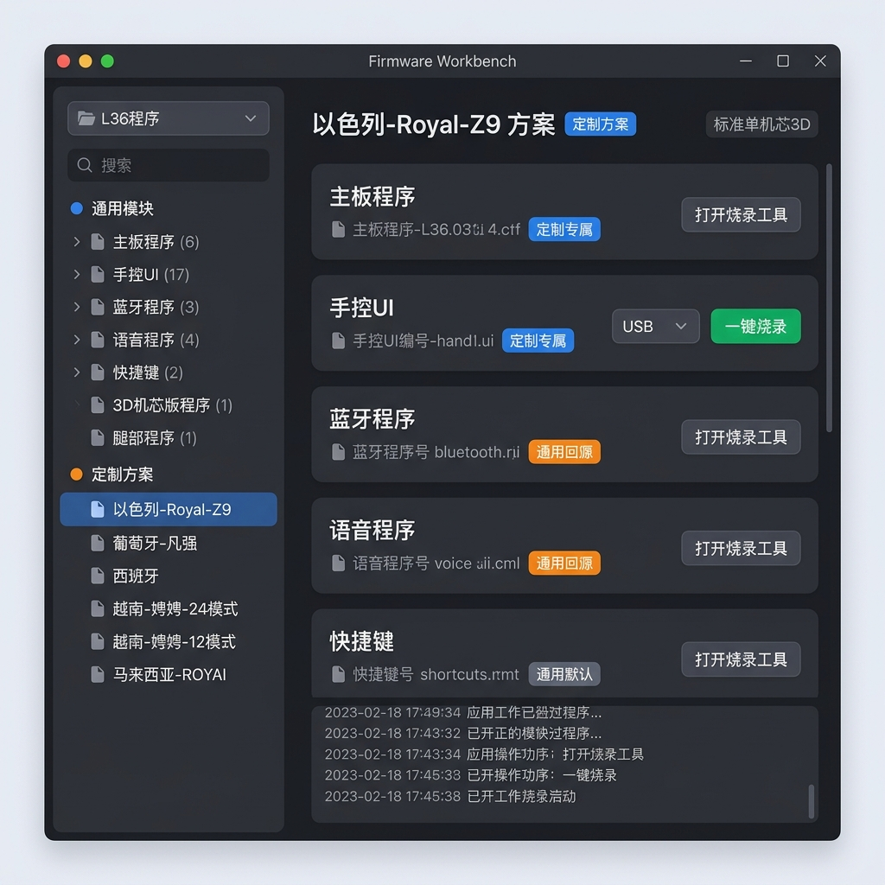

# UI 重设计方案：工作台模式

> 日期：2026-06-06
> 状态：待确认
> 前置：types.py / asset_index.py / file_scan.py 的 Schema v3 改造已完成

## 效果图预览


## 一、现有 UI 的问题

现有 UI 的交互流程是：
```
选择固件类型（下拉框）→ 左侧 TreeView 显示该类型的所有资产 → 选中一个 → 右侧操作区执行烧录
```

这种流程的问题：
1. **必须先知道固件类型才能开始操作**——烧录员拿到一套方案时，想的是"以色列这套要刷什么"，而不是"我要刷主板"。
2. **无法看到一个方案的完整模块清单**——以色列方案定制了主板、手控、蓝牙，但通用的腿部、语音需要用默认的，现在完全看不到这个"全貌"。
3. **无法区分通用和定制**——所有资产混在一起，无法快速判断"这个主板是通用的还是以色列专用的"。
4. **没有工作台概念**——无法在软件内完成增删改查，只能去外面操作文件夹。

## 二、新 UI 交互流程

### 核心理念：方案工作台（Scheme Workbench）

```
┌─────────────────────────────────────────────────────────────────────┐
│  📂 L36程序  [切换型号 ▼]        🔍 搜索关键词...         [扫描] [设置] │
├──────────────────────┬──────────────────────────────────────────────┤
│                      │                                              │
│  ── 通用模块 ──      │        === 模块清单 ===                       │
│   ├ 主板程序 (6)     │                                              │
│   ├ 手控UI (17)      │   ┌─ 主板程序 ─────────────────────────────┐ │
│   ├ 蓝牙程序 (3)     │   │  📄 YJ_3DMain...V40.bin               │ │
│   ├ 语音程序 (4)     │   │  🏷️ 来源: 通用/量产_默认               │ │
│   ├ 快捷键 (2)       │   │  ⚙️ 模式: tool_launch                  │ │
│   ├ 3D机芯 (1)       │   │  [打开烧录工具]                        │ │
│   ├ 腿部 (1)         │   └──────────────────────────────────────── │
│   └ 2D机芯 (0)       │                                              │
│                      │   ┌─ 手控UI ───────────────────────────────┐ │
│  ── 定制方案 ──      │   │  📄 ITE_NOR_yj_massage_L36.rom        │ │
│   ├ 以色列-Royal-Z9  │   │  🏷️ 来源: 定制/以色列 (专属)           │ │
│   ├ 葡萄牙-凡强      │   │  ⚙️ 模式: auto_usb                    │ │
│   ├ 西班牙            │   │  [U盘: F:  ▼]  [一键烧录]             │ │
│   ├ 越南-娉娉-24模式  │   └──────────────────────────────────────── │
│   ├ 越南-娉娉-12模式  │                                              │
│   └ 马来西亚-ROYAI    │   ┌─ 蓝牙程序 ──────────────────────────── │
│                      │   │  📄 BT_L36_CN_V2.bin                  │ │
│                      │   │  🏷️ 来源: 通用/中文-通用_默认 (回源)    │ │
│                      │   │  ⚙️ 模式: tool_launch                  │ │
│                      │   │  [打开烧录工具]                        │ │
│                      │   └──────────────────────────────────────── │
│                      │                                              │
│                      │   ... 语音、快捷键、机芯、腿部 ...           │
│                      │                                              │
├──────────────────────┴──────────────────────────────────────────────┤
│  📋 操作日志                                                        │
└─────────────────────────────────────────────────────────────────────┘
```

### 交互说明

| 操作 | 效果 |
|------|------|
| **型号切换与搜索** | 左上角的 `[切换型号]` 改为**可搜索的下拉组合框 (ComboBox)**。输入 "L36" 即可快速匹配对应的型号汇总目录。 |
| **全局搜索（关键字/模块名）** | 顶部的 `🔍 搜索关键词...` 栏支持**多维搜索**：输入「主板」或「手控」会过滤出特定的模块；输入「防夹」等关键字会实时过滤左侧树和右侧列表，只显示相关的变体。 |
| **点击「通用模块 → 主板程序」** | 右侧展示主板程序的所有变体列表（量产_默认、减少灯光亮度、防夹功能...），可搜索、可操作。 |
| **点击「定制方案 → 马来西亚-ROYAI」** | 右侧展示该方案的完整模块清单。**如果某个模块有多个变体**（如包含 3 个不同版本的手控UI文件夹），则右侧会并排或上下展示这 3 张卡片，卡片标题会附加具体的文件夹名（如 `手控UI (不带披肩加热-目前使用)`），供烧录员按需操作。 |
| **双击模块卡片** | 支持鼠标**双击模块卡片**（或者点击专门的 `[📂]` 图标）直接在 Windows 资源管理器中打开该程序所在的文件夹。 |

### 卡片中的"来源"标签说明

| 标签 | 含义 | 样式 |
|------|------|------|
| `通用/量产_默认` | 通用区的默认变体 | 灰色标签 |
| `定制/以色列 (专属)` | 该方案自带的定制文件 | 蓝色标签 |
| `通用/中文-通用_默认 (回源)` | 方案未提供该模块，自动从通用区回源 | 黄色/橙色标签 |

### 模块卡片的操作按钮

| 固件类型 | flash_mode | 操作按钮 |
|---------|------------|---------|
| 手控UI | `auto_usb` | `[U盘: F: ▼] [一键烧录]` — 选U盘，一键拷贝 |
| 主板/蓝牙/语音/快捷键/机芯 | `tool_launch` | `[打开烧录工具]` — 启动对应的官方烧录工具 |
| 接线图 | `disabled` | `[打开文件夹]` — 只看不操作 |

## 三、左侧导航树的结构

```
📂 L36程序
├── 🔵 通用模块
│   ├── 主板程序 (6)          ← 括号内显示变体数量
│   ├── 手控UI (17)
│   ├── 蓝牙程序 (3)
│   ├── 语音程序 (4)
│   ├── 快捷键 (2)
│   ├── 3D机芯版程序 (1)
│   ├── 2D机芯版程序 (0)
│   ├── 腿部程序 (1)
│   └── 双机芯-上3D-下2D
│       ├── 主板程序 (1)
│       └── 快捷键 (1)
│
└── 🟠 定制方案
    ├── 以色列-Royal-Z9       ← 点击后右侧显示完整模块清单
    ├── 葡萄牙-凡强
    ├── 西班牙
    ├── 越南-娉娉-24模式
    ├── 越南-娉娉-12模式
    └── 马来西亚-ROYAI
```

## 四、与现有架构的关系

| 现有组件 | 去留 | 说明 |
|---------|------|------|
| `shell.py` | **保留** | 改为加载新的主面板 |
| `firmware_list_panel.py` | **重写** | 改名为 `workbench_panel.py`，整体替换交互逻辑 |
| `sidebar_panel.py` | **重写** | 导航树从"按类型筛选"改为"通用/定制分区" |
| `asset_tree.py` | **保留改造** | TreeView 数据源改为按 category/scheme 分组 |
| `operation_panels/` | **保留** | 操作面板（auto_usb / tool_launch）逻辑不变 |
| `design_tokens.py` | **保留** | 设计系统不变 |
| `view_models/` | **新增** | 新增 `scheme_workbench_model.py`、`module_card_model.py` |

## 五、实施步骤

1. 新建 `workbench_panel.py`，逐步替换 `firmware_list_panel.py`
2. 改造 `sidebar_panel.py` 的导航树
3. 新增模块卡片组件
4. 确保旧版功能（搜索、烧录）不丢失，只是交互入口变了
